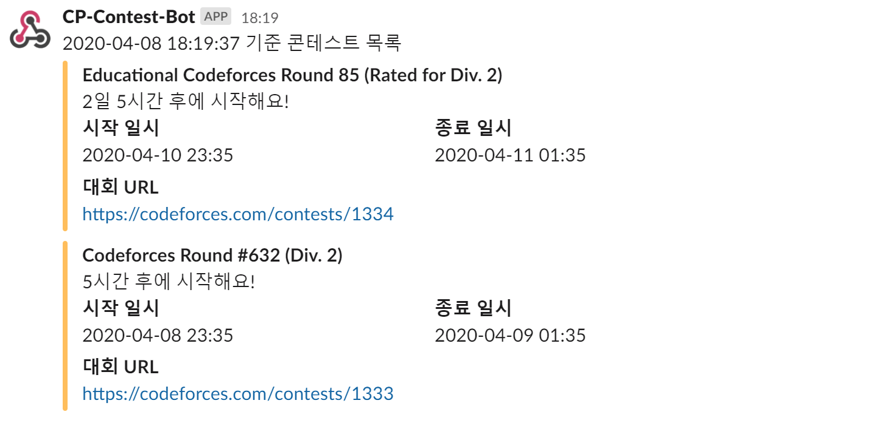

# CP-Contest-Bot  
온라인 알고리즘 콘테스트 일정을 Slack에 알려주는 WebHook  
  

## 가져오는 것들  
- Codeforces  
- Atcoder  

## 메모  
### 어떻게 했는가  
- Slack에 Incoming WebHooks, Outgoing WebHooks 하나씩 설치  
- Incoming WebHooks는 POST로 들어온 json을 Slack에 메시지로 뿌려주는 역할이고,  
- Outgoing WebHooks는 Slack에서 trigger가 발생하면(누군가 특정 메시지를 입력한다던가), 지정된 URL로 GET 요청을 보낸다  
- Slack의 Outgoing에 Lambda API Gateway 트리거 URL을 붙여주고  
- Lambda에서 POST request를 Incoming에다가 보내주면 된다  

### 기타
- 여러 대회 일정 모아서 API로 제공하는 사설 사이트도 있더라. 따로 크롤링 안 하고 이걸 썼으면 더 편했을 테지만, 어차피 안 찾아봤을 듯. 그냥 내가 만들어보는 것에 의의가 있으니 뭐...

## TODO
- [x] Atcoder support
- [x] ~~당일 시작하는 콘테스트가 있을 경우 따로 알림~~ 대회 얼마나 남았는지를 따로 출력
- [x] Use serverless
- [ ] Slack에서 attachment 대신에 blocks 사용하기 

## 참고한 URL
- https://codeforces.com/apiHelp/objects#Contest